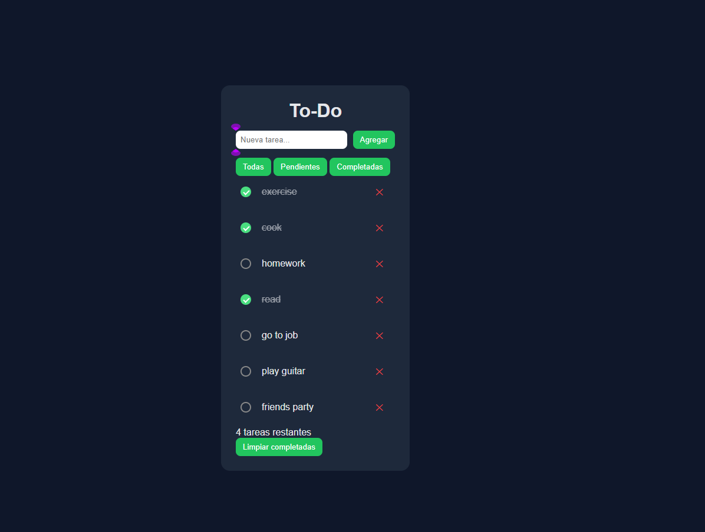

# 📝 ToDo App

A simple and useful To-Do application to add, check, and delete any task you need.

It includes task filters, a remaining-tasks counter, drag & drop reordering, and a dark mode toggle to switch the interface theme based on your preference.
You can also quickly clear all completed tasks.

---

## 🚀 Live Demo

👉 https://aaron-pixel98.github.io/ToDo.App/

---

## ✨ Features

* Add new tasks
* Mark tasks as completed
* Delete tasks
* Filter by **All / Pending / Done**
* Remaining tasks counter
* Clear completed tasks button
* Drag & drop task reordering
* Dark mode with system detection
* Data persistence using **LocalStorage**

---

## 🛠️ Built With

* **HTML5**
* **CSS3**
* **JavaScript (Vanilla JS)**
* **GitHub Pages** for deployment

---

## 📸 Preview

---

## 📚 What I Learned

* DOM manipulation with JavaScript
* Event handling and state management
* Using LocalStorage to persist data
* Implementing drag & drop in HTML5
* Deploying a project with GitHub Pages

---

## 👨‍💻 Author

**Aarón R.**

First personal project published on the web as part of my journey to become a **Frontend Developer** 🚀
